# 🚀 快速上手指南 - RMT（若梦兔）

本页介绍 RMT（若梦兔） 的基础使用方式，帮助你快速创建常见的按键宏操作。

---

## 1️⃣ 按键触发连点器

**功能说明**：当你按下触发键时，RMT（若梦兔） 软件会辅助你快速连续点击按键。

**操作步骤**：

1. 添加新宏: 点击左侧`新增配置`按钮。
2. 设置触发按键：点击`触发键`按钮，新窗口选择触发键，例如 `F6`。
3. 设置宏指令：点击 `宏指令`按钮 → 指令选项中点击 `按键` → 点击按键`A` → 设置`按键时间80`,`循环次数10` → 点击按键编辑界面`确定`按钮 → 点击宏指令编辑界面`确定`按钮。

    
    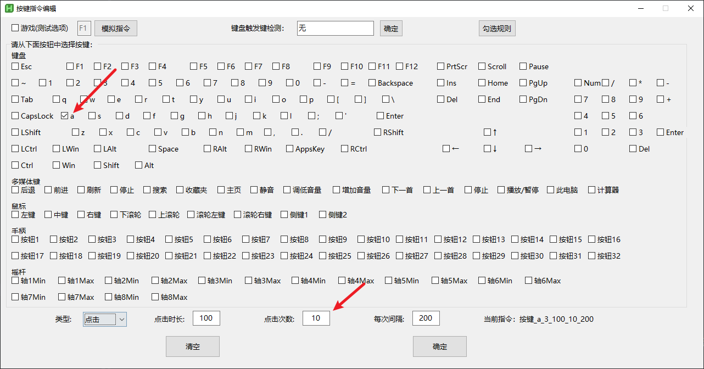
    ***图示：按键指令配置界面***
4. 主界面左侧点击`应用并保存`按钮即可。

     
    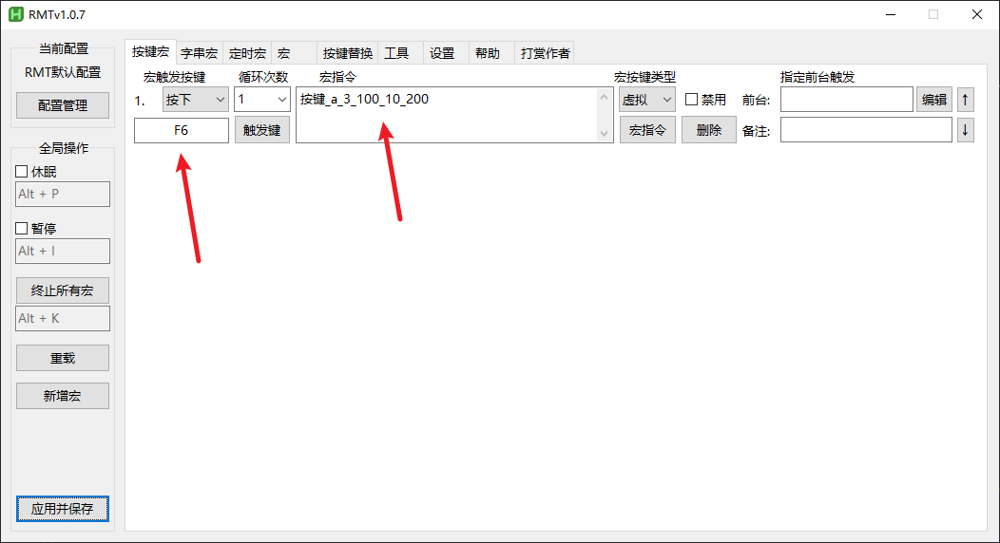 
    ***图示：最终配置界面***

**配置效果**：当按下触发键`F6`时,软件辅助按下`10`次`A`键，每次按键时间`80ms`，每次间隔默认`100ms`，指令总时长`1800ms`

---

## 2️⃣ 组合键触发宏

**功能说明**：只有当一组特定组合键同时按下时，才会触发宏。

**操作步骤**：

1. 添加新宏: 点击左侧`新增配置`按钮。
2. 设置触发按键：在`触发键`编辑界面勾选你想要的组合键，例如 `Ctrl + Alt + A`。

     
    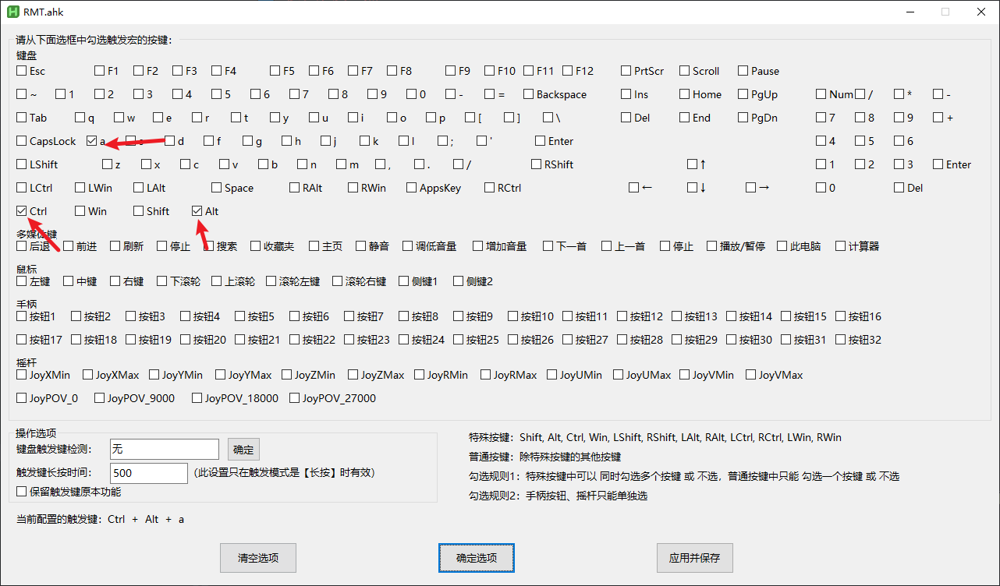 
    ***图示：触发键配置界面***
3. 设置宏指令：在`宏指令`编辑界面 → 指令选项中点击 `输出` → `文本框`中输入`RMT` → 点击输出编辑界面`确定`按钮 → 点击宏指令编辑界面`确定`按钮。

     

    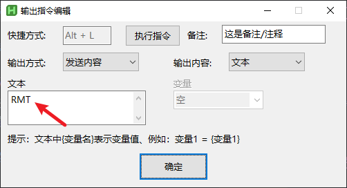 

    ***图示：输出指令配置界面***

4. 主界面左侧点击`应用并保存`按钮即可。

     
     
    ***图示：最终配置界面***

**配置效果**：当按下触发键`Ctrl + Alt + A`时,软件辅助输出`RMT`文本

---

## 3️⃣ 按键触发组合键

**功能说明**：按下一个键，让它自动执行一组组合键动作，比如按下 `F9` 自动发送 `Ctrl + V`。

**操作步骤**：

1. 添加新宏: 点击左侧`新增配置`按钮。
2. 设置触发按键：点击`触发键`按钮，新窗口选择触发键，例如 `F9`。
3. 设置指令模式： `指令串联` → `指令并联`
4. 设置宏指令：在`宏指令`编辑界面 → 指令选项中点击 `按键` → 点击 `Ctrl`  → 确定 → 指令选项中点击 `按键` → 点击 `V`  → 确定 → 点击宏指令编辑界面`确定`按钮。
5. 主界面左侧点击`应用并保存`按钮即可。

     
    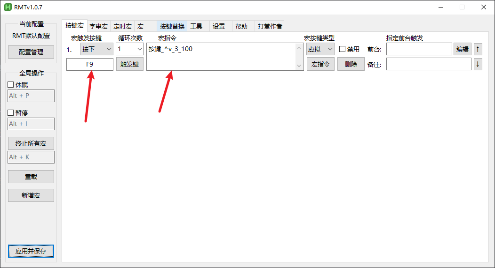 
    ***图示：最终配置界面***

**配置效果**：当按下触发键`F9`时,软件辅助按下`Ctrl + V`

---

## 4️⃣ 搜索图片（图像识别）

**功能说明**：寻找屏幕上的某张图片，找到后执行点击动作。（按键实现b站点赞）

**操作步骤**：

1. 添加新宏: 点击左侧`新增配置`按钮。
2. 设置触发按键：点击`触发键`按钮，新窗口选择触发键，例如 `F7`。
3. 设置宏指令：在`宏指令`编辑界面 → 指令选项中点击 `搜索`。
4. 打开UP的B站视频：https://www.bilibili.com/video/BV1oWVRzaEzk
5. 设置图片：点击`截图`按钮，截取你要识别的图片，只要截图能识别的特征部分

     
     

    

    ***图示：截图内容（要自己截图，因为电脑的色差，缩放不同）***

6. 设置搜索区域（可选）：按`F1`后`鼠标左键`点击拖拽一个矩形区域
7. 设置点击：勾选找到后鼠标移动至目标点击

     

     

    ***图示：搜索指令配置结果***
8. 确定设置：点击输出编辑界面`确定`按钮 → 点击宏指令编辑界面`确定`按钮。
9. 主界面左侧点击`应用并保存`按钮即可。

    

    
    ***图示：最终配置界面***

**配置效果**：当按下触发键`F7`时,软件辅助找到点赞图标，移动过去自动点击

📌 注意：图像不能经过缩放，图像路径不能包含下划线，图像大小48*48识别效果最佳。减小搜索范围可以降低性能消耗，增加搜索速度。

---

## 5️⃣ 搜索颜色

**功能说明**：在指定屏幕区域查找某个颜色（可用于检测 UI 状态）。

**操作步骤**：

1. 添加新宏: 点击左侧`新增配置`按钮。
2. 设置触发按键：点击`触发键`按钮，新窗口选择触发键，例如 `F6`。
3. 设置宏指令：在`宏指令`编辑界面 → 指令选项中点击 `搜索`。
4. 设置搜索类型：搜索类型选择颜色
5. 取色：鼠标移动到取色为止，按`F2`即可完成取色，颜色文本框会自动填写颜色值
6. 设置搜索区域（可选）：按`F1`后`鼠标左键`点击拖拽一个矩形区域
7. 设置找到后指令：配置任意指令即可
8. 设置未找到后指令：配置任意指令即可

     

    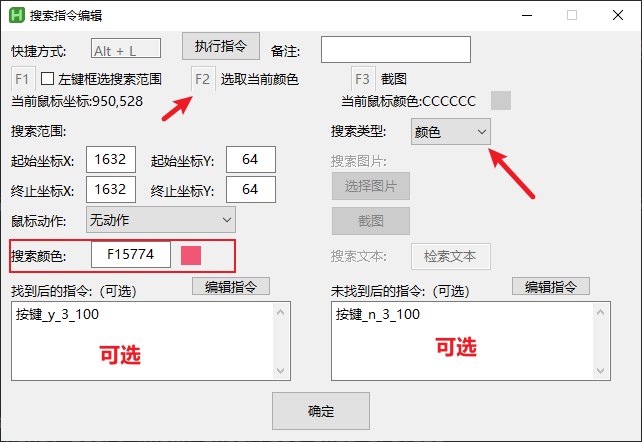

    ***图示：搜索指令配置结果***
9. 确定设置：点击输出编辑界面`确定`按钮 → 点击宏指令编辑界面`确定`按钮。
10. 主界面左侧点击`应用并保存`按钮即可。

     

     
    ***图示：最终配置界面***

**配置效果**：当按下触发键`F6`时,软件辅助找到颜色执行找到后指令，否则执行未找到后指令

📌 注意：减小搜索范围可以降低性能消耗，增加搜索速度，不限定搜索范围，屏幕中只要有这个颜色就会触发，这可能是你不需要的。

---

## 6️⃣ 搜索文本（OCR 识别）

**功能说明**：识别屏幕上的文字内容，并据此执行条件操作。

**操作步骤**：

1. 添加新宏: 点击左侧`新增配置`按钮。
2. 设置触发按键：点击`触发键`按钮，新窗口选择触发键，例如 `F3`。
3. 设置宏指令：在`宏指令`编辑界面 → 指令选项中点击 `搜索`。
4. 设置搜索类型：搜索类型选择文本
5. 设置文本：在文本编辑框输入搜索的文本（例如：测试文本）
6. 设置搜索区域（可选）：按`F1`后`鼠标左键`点击拖拽一个矩形区域
7. 设置找到后指令：配置任意指令即可
8. 设置未找到后指令：配置任意指令即可

    

    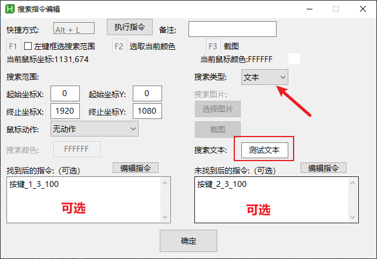  
    ***图示：搜索指令配置结果***
9. 确定设置：点击输出编辑界面`确定`按钮 → 点击宏指令编辑界面`确定`按钮。
10. 主界面左侧点击`应用并保存`按钮即可。

     

     
    ***图示：最终配置界面***

**配置效果**：当按下触发键`F3`时,软件辅助识别文本后执行找到后指令，否则执行未找到后指令

📌 注意：减小搜索范围可以降低性能消耗，增加搜索速度，若软件RapidOcr\models\ppocr_keys_v1.txt中无特定字库，请手动添加到文本顶部

---

## 7️⃣ 鼠标移动

**功能说明**：将鼠标自动移动到指定坐标

**操作步骤**：

1. 添加新宏: 点击左侧`新增配置`按钮。
2. 设置触发按键：点击`触发键`按钮，新窗口选择触发键，例如 `F4`。
3. 设置宏指令：点击 `宏指令`按钮 → 指令选项中点击 `移动`
4. 设置移动坐标：修改`坐标位置x`、`坐标位置y`
5. 设置移动速度：修改移动速度（100则瞬移）

    

    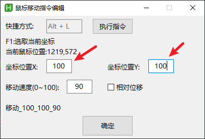

    ***图示：搜索指令配置结果***
6. 点击移动编辑界面`确定`按钮 → 点击宏指令编辑界面`确定`按钮。
7. 主界面左侧点击`应用并保存`按钮即可。

    

     
    ***图示：最终配置界面***

**配置效果**：当按下触发键`F4`时,软件辅助鼠标移动至桌面坐标（100,100）

---

## 8️⃣ 指令录制（宏录制器）

**功能说明**：自动录制你在键盘和鼠标上的操作，自动生成并联宏。

**操作步骤**：

1. 打开录制：主界面 → 工具 → 打开 `指令并联录制`
2. 在任意地方执行你想要录制的动作（按键、点击等）。
3. 关闭 `指令并联录制`（指令已经复制到剪切板中）
    
    

    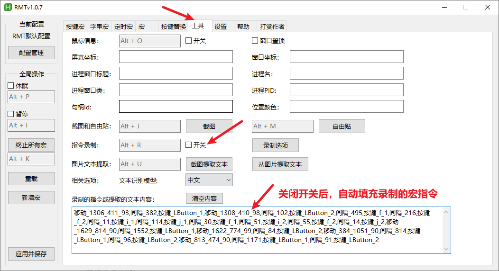 
    ***图示：指令录制界面***
4. `按键宏页签`下添加新宏: 点击左侧`新增配置`按钮。
5. 设置触发按键：点击`触发键`按钮，新窗口选择触发键，例如 `F9`。
6. 设置宏指令：`Ctrl+V`粘贴到宏指令中
7. 修改指令模式：`指令串联`改成`指令并联`
8. 主界面左侧点击`应用并保存`按钮即可。

    

     
    ***图示：最终配置界面***

**配置效果**：当按下触发键`F9`时,自动执行录制的内容

📌 录制器适合快速搭建流程操作，之后可手动微调。

---

## 9️⃣ 字串宏（双击触发）

**功能说明**：当按下一系列设定的字串时，触发宏。

**操作步骤**：

1. 选择字串宏页签: 主界面下点击切换到`字串宏`页签。
2. 添加新宏: 点击左侧`新增配置`按钮。
3. 设置触发按键：点击`触发键`按钮，新窗口点击两次`按钮A`。

    

    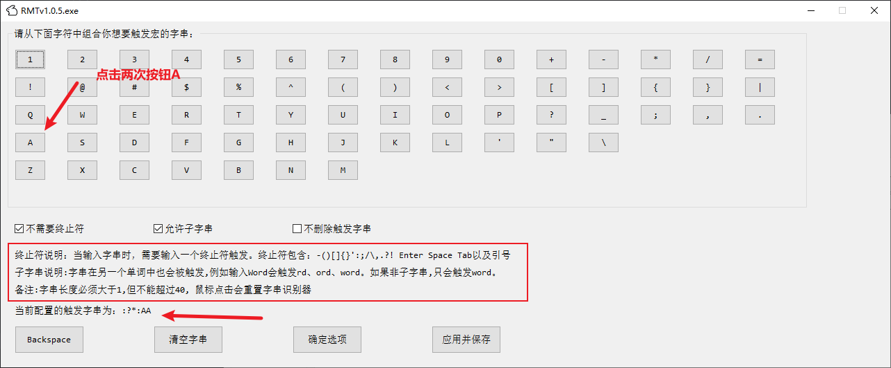 
    ***图示：字串宏触发键配置界面***
3. 设置宏指令：点击 `宏指令`按钮 → 指令选项中点击 `文件` → 进程下输入`notepad.exe` → 点击编辑界面`确定`按钮 → 点击宏指令编辑界面`确定`按钮。

     

    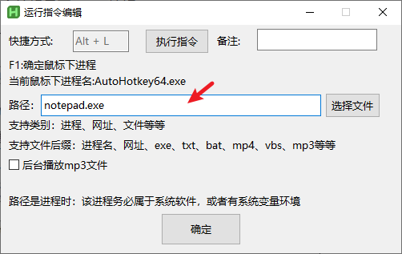
    ***图示：文件指令配置界面***
4. 主界面左侧点击`应用并保存`按钮即可。

    

      
    ***图示：最终配置界面***

**配置效果**：当双击`按键A`,软件辅助打开notepad.exe

📌 字串宏适合双击触发，或者多个按键顺序组合触发。

---

