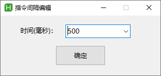
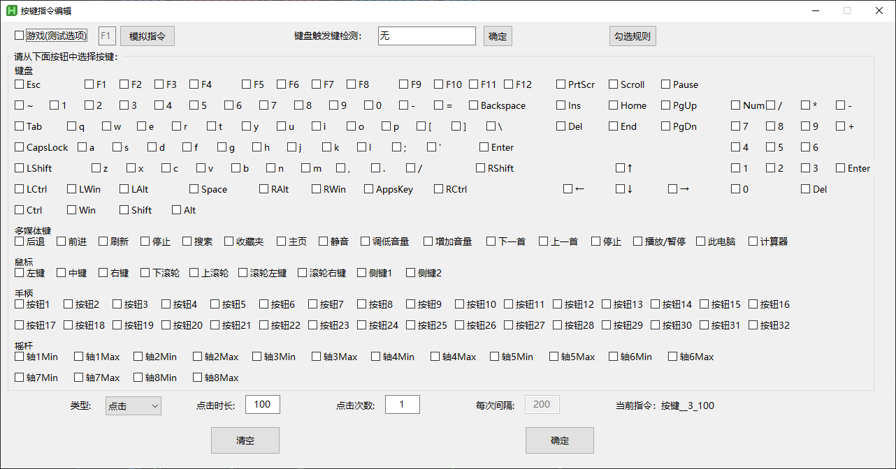
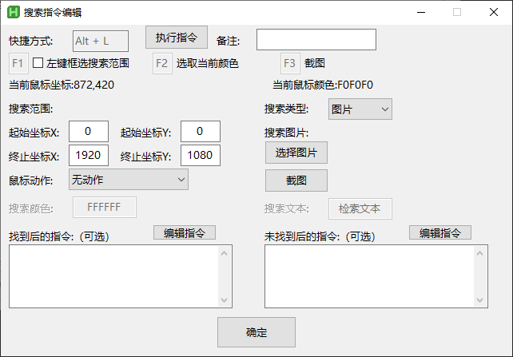
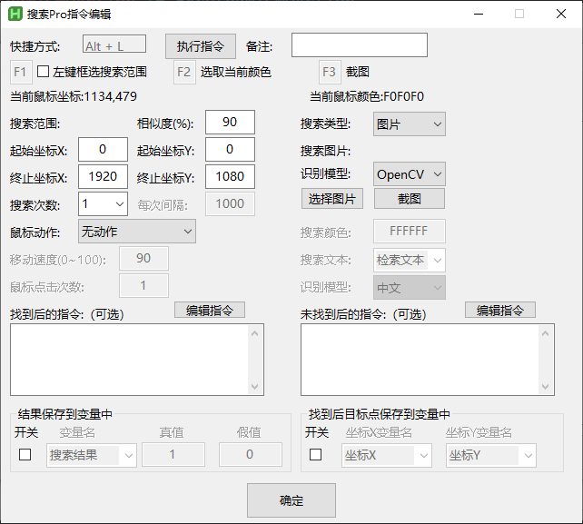

# 🚀 指令手册 - RMT（若梦兔）

本页介绍 RMT（若梦兔） 各个指令的功能，参数效果，帮助你快速掌握指令。

---

## 1️. 间隔

指令界面

***图示：指令配置界面***

**功能说明**

1. 用于间隔其他指令操作：间隔指令插入其他指令之中
2. 调控宏循环间隔时间：间隔指令添加到宏指令末尾

**时间参数解析**
1. 整数：间隔指令执行对应的时长（毫秒）
2. 变量：间隔指令执行变量值对应的时长（毫秒）

---

## 2️. 按键

指令界面

***图示：指令配置界面***

**功能说明**

1. 设置按键不同的动作：按下，松开，点击

**手柄按键说明**
1. 使用前需要安装vjoy，详情查看`手柄功能指令`

**勾选说明**

特殊按键：Shift, Alt, Ctrl, Win, LShift, RShift, LAlt, RAlt, LCtrl, RCtrl, LWin, RWin
普通按键：除特殊按键的其他按键
勾选规则1：特殊按键中可以 同时勾选多个按键 或 不选，普通按键中只能 勾选一个按键 或 不选
勾选规则2：手柄按钮、摇杆只能单独选

**键盘按键检测**

1. 点击输入框
2. 按下对应按键/组合按键
3. 点击确定按钮后自动勾选对应的按键

**参数解析**

1. 类型：按下、松开、点击对应按键不同的操作（后续参数只有点击操作才能配置）
2. 点击时间：按键的点击时，按下到松开的时间
3. 点击次数：设置按键点击时的连续点击次数
4. 每次间隔：设置按键松开到下一次按下的时间

**指令格式**

按键_按键名_按键类型_点击时间_点击次数_每次间隔

---

## 3️⃣. 搜索
指令界面

***图示：指令配置界面***

**功能说明**

在电脑屏幕上搜索图片，颜色，文本，再根据结果执行不同的分支指令

**快捷键**
1. F1 开启左键框选搜索范围，左键松开后自动关闭该功能
2. F2 选取鼠标下当前颜色，同时限定搜索范围为该像素坐标
3. F3 截图设置搜索图片需要的图片素材

**搜索范围**
指定范围：搜索时将从屏幕的起始坐标到终止坐标范围中搜索

**搜索类型**
1. 图片：选择图片或截图设置搜索元素，在屏幕上的搜索范围中搜索对应图片
2. 颜色：搜索颜色处输入颜色值或F2取色，在屏幕上的搜索范围中搜索对应颜色
3. 文本：搜索文本处输入文本，在屏幕上的搜索范围中搜索对应文本（支持正则表达式）

**鼠标动作**
无动作：搜索到鼠标不进行任何操作
移动至目标：鼠标移动到目标点位
移动至目标点击1次：鼠标移动到目标点位鼠标左键点击1次
移动至目标点击2次：鼠标移动到目标点位鼠标左键点击2次

**结果指令**
搜索到目标，执行找到后的指令（可选）
未搜索到目标，执行未找到后的指令（可选）

## 3️⃣. 搜索Pro
指令界面

***图示：指令配置界面***

**相似度**
屏幕元素和搜索素材的相似度，值越大越严格

**搜索次数**
进行多次搜索，直到搜索次数用尽仍未搜索到时，执行未找到后指令，指令结束
搜索次数用尽前搜索到目标，执行找到后指令，指令结束

**搜索间隔**

